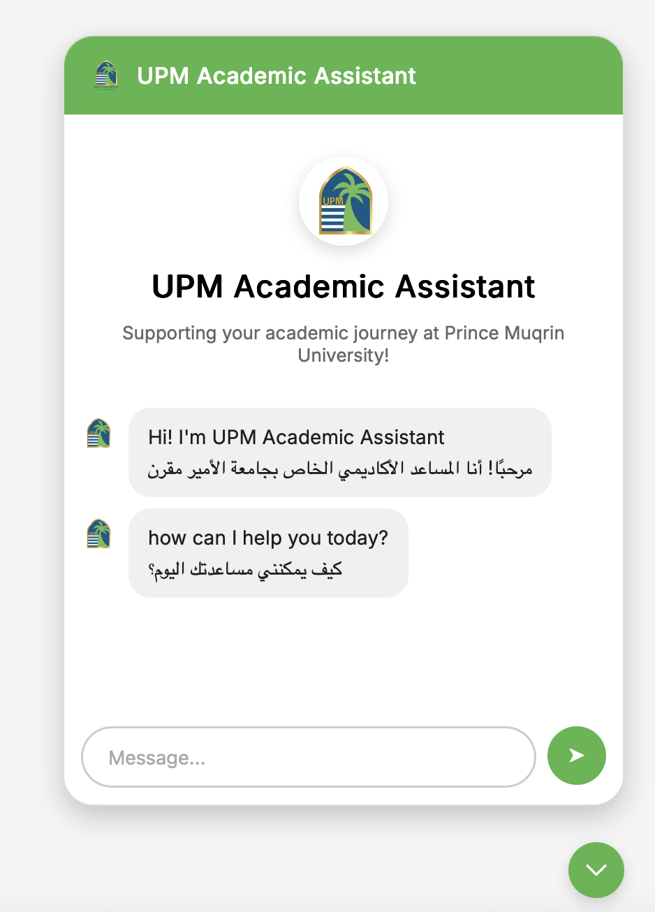
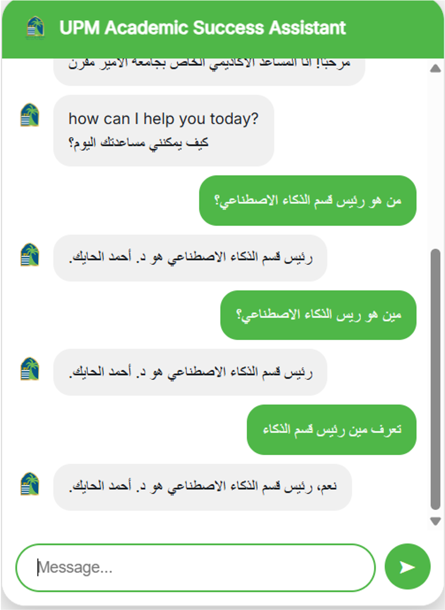
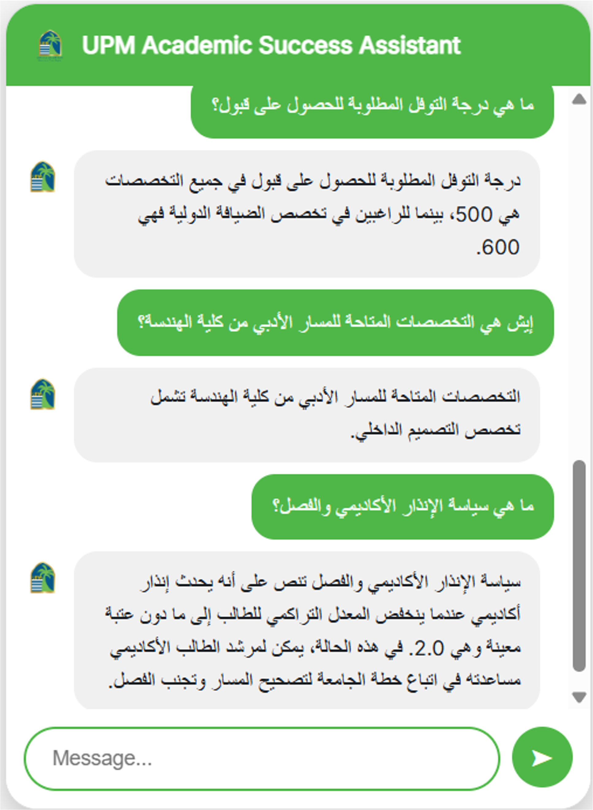

# UPM Advising Chatbot 💬

An AI-powered bilingual chatbot designed during my COOP training at Prince Mugrin bin Abdulaziz University (UPM).  
It assists students with academic advising, course information, and university policies — in both Arabic and English.

---

## 🧠 Overview
This project uses the **OpenAI Assistants API** to deliver accurate, document-grounded answers to student queries.  
It includes a simple **web interface** with a typing animation and clean, mobile-friendly chat widget.

---

## ✨ Key Features
- 🤖 **Bilingual Support (Arabic & English)** — replies in the user’s language  
- 📚 **Smart Search** — fetches info directly from university documents  
- 💬 **Interactive UI** — chat widget with typing animation and RTL support  
- 🔒 **Efficient Backend** — built with Node.js and Express  

---

## 🧰 Tech Stack
- **Languages:** JavaScript (Node.js), HTML, CSS 
- **Backend:** Node.js + OpenAI Assistant API
- **Frontend:** HTML, CSS, JS (Chat UI built in Replit)
- **Other Tools:** Replit, GitHub, VSCode

---

## 📸 Screenshots

  

  

### Chat Interface

### Conversation Example

---

## 🏁 Project Type
Developed as part of my **COOP training** at **UPM**, focused on AI-powered academic tools.

